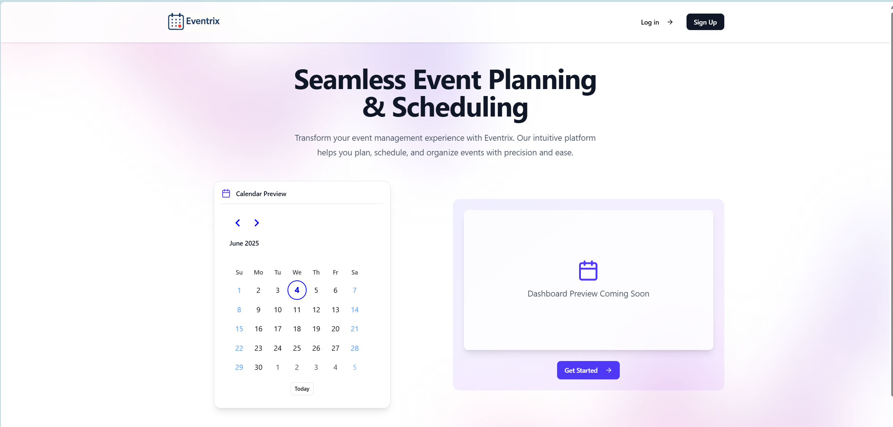
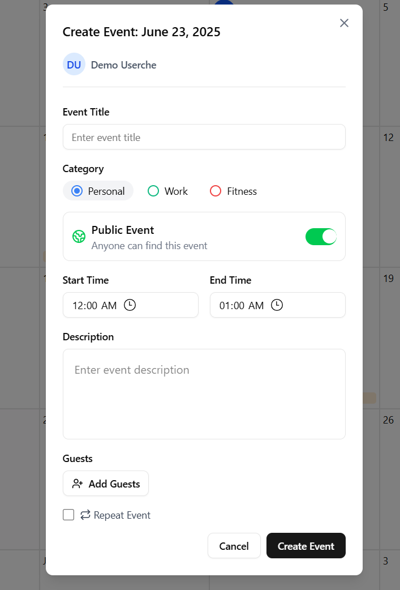

# 📅 Eventrix – Modern Calendar Event Management

---

## 🌟 Overview

**Eventrix** is a full-stack calendar app that enables users to efficiently manage events, schedule meetings, and organize their time. Built as a final academy project, it showcases modern web technologies and strong software architecture.

## 🛠️ Tech Stack

### Core Technologies

| Technology                                                                                                                                     | Description                    |
| ---------------------------------------------------------------------------------------------------------------------------------------------- | ------------------------------ |
|  Next.js | Full-stack React framework     |
|  PostgreSQL      | Robust database system         |
| Drizzle ORM                                                                                                                                    | Type-safe SQL toolkit          |
| Neon                                                                                                                                           | Serverless PostgreSQL platform |

---

## 🚀 Features

### 🏠 Landing Page



Clean, welcoming intro page highlighting Eventrix's core capabilities.

---

### 📊 Interactive Dashboard


Dynamic calendar views (Month, Week, Day) with drag-and-drop events.

---

### ✍️ Event Creation



Rich form to create events with recurrence, tags, and participants.

### Frontend Technologies

| Technology   | Description                 |
| ------------ | --------------------------- |
| Tailwind CSS | Utility-first CSS framework |
| shadcn/ui    | Accessible UI components    |
| Day.js       | Modern date utility library |

### Authentication & Security

| Technology  | Description              |
| ----------- | ------------------------ |
| NextAuth.js | Authentication framework |
| Bcrypt      | Password hashing         |

---

## 🧰 Technical Highlights

- 🔐 **Authentication** with NextAuth.js + Bcrypt
- ⚡ **Real-Time** updates and calendar syncing
- 📱 **Responsive Design** with Tailwind CSS
- 🧠 **Type-Safe** with full TypeScript
- 🌍 **Time Zone** aware scheduling
- 🧩 Modular structure following best practices

---

## 🔧 Getting Started

```bash
# 1. Clone the repository
git clone https://github.com/yourusername/eventrix.git

# 2. Install dependencies
npm install

# 3. Setup environment variables
cp .env.example .env.local
# Edit .env.local with your configuration

# 4. Run development server
npm run dev
```
